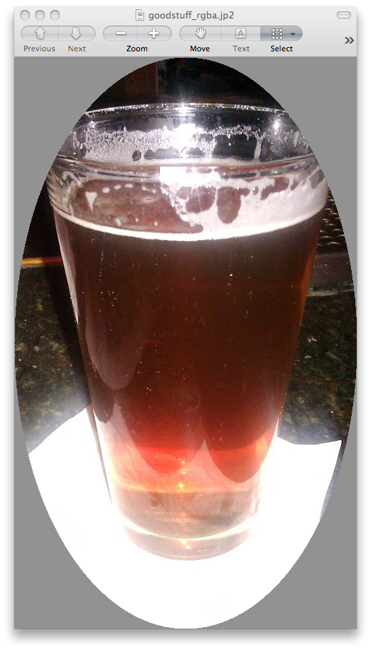

------------
How do I...?
------------

... read images?
================
Jp2k implements slicing via the :py:meth:`__getitem__` method, meaning that 
multiple resolution imagery in a JPEG 2000 file can
easily be accessed via array-style slicing.  For example here's how to
retrieve a full resolution and first lower-resolution image ::

    >>> import glymur
    >>> jp2file = glymur.data.nemo() # just a path to a JPEG2000 file
    >>> jp2 = glymur.Jp2k(jp2file)
    >>> fullres = jp2[:]
    >>> fullres.shape
    (1456, 2592, 3)
    >>> thumbnail = jp2[::2, ::2]
    >>> thumbnail.shape
    (728, 1296, 3)

... make use of OpenJPEG's thread support to read images?
=========================================================
If you have glymur 0.8.13 or higher
and OpenJPEG 2.2.0 or higher,
you can make use of OpenJPEG's thread support to speed up read operations ::

    >>> import glymur
    >>> import time
    >>> jp2file = glymur.data.nemo()
    >>> jp2 = glymur.Jp2k(jp2file)
    >>> t0 = time.time(); data = jp2[:]; t1 = time.time()
    >>> t1 - t0
    0.9024193286895752
    >>> glymur.set_option('lib.num_threads', 2)
    >>> t0 = time.time(); data = jp2[:]; t1 = time.time()
    >>> t1 - t0
    0.4060473537445068

... write images?
=================
It's pretty simple, just supply the image data as the 2nd argument to the Jp2k
constructor.
    
    >>> import glymur, numpy as np
    >>> jp2 = glymur.Jp2k('zeros.jp2', data=np.zeros((640, 480), dtype=np.uint8))

You must have OpenJPEG version 1.5 or more recent in order to write JPEG 2000
images with glymur.

... display metadata?
=====================
There are two ways.  From the command line, the console script **jp2dump** is
available. ::

    $ jp2dump /path/to/glymur/installation/data/nemo.jp2

From within Python, the same result is obtained simply by printing the Jp2k
object, i.e. ::

    >>> import glymur
    >>> jp2file = glymur.data.nemo() # just a path to a JP2 file
    >>> jp2 = glymur.Jp2k(jp2file)
    >>> print(jp2)
    File:  nemo.jp2
    JPEG 2000 Signature Box (jP  ) @ (0, 12)
        Signature:  0d0a870a
    File Type Box (ftyp) @ (12, 20)
        Brand:  jp2 
        Compatibility:  ['jp2 ']
    JP2 Header Box (jp2h) @ (32, 45)
        Image Header Box (ihdr) @ (40, 22)
            Size:  [1456 2592 3]
            Bitdepth:  8
            Signed:  False
            Compression:  wavelet
            Colorspace Unknown:  False
        Colour Specification Box (colr) @ (62, 15)
            Method:  enumerated colorspace
            Precedence:  0
            Colorspace:  sRGB
    UUID Box (uuid) @ (77, 3146)
        UUID:  be7acfcb-97a9-42e8-9c71-999491e3afac (XMP)
        UUID Data:  
        <ns0:xmpmeta xmlns:dc="http://purl.org/dc/elements/1.1/" xmlns:ns0="adobe:ns:meta/" xmlns:ns2="http://ns.adobe.com/xap/1.0/" xmlns:ns3="http://ns.adobe.com/tiff/1.0/" xmlns:ns4="http://ns.adobe.com/exif/1.0/" xmlns:ns5="http://ns.adobe.com/photoshop/1.0/" xmlns:rdf="http://www.w3.org/1999/02/22-rdf-syntax-ns#" ns0:xmptk="Exempi + XMP Core 5.1.2">
          <rdf:RDF>
            <rdf:Description rdf:about="">
              <ns2:CreatorTool>Google</ns2:CreatorTool>
              <ns2:CreateDate>2013-02-09T14:47:53</ns2:CreateDate>
            </rdf:Description>
            <rdf:Description rdf:about="">
              <ns3:YCbCrPositioning>1</ns3:YCbCrPositioning>
              <ns3:XResolution>72/1</ns3:XResolution>
              <ns3:YResolution>72/1</ns3:YResolution>
              <ns3:ResolutionUnit>2</ns3:ResolutionUnit>
              <ns3:Make>HTC</ns3:Make>
              <ns3:Model>HTC Glacier</ns3:Model>
              <ns3:ImageWidth>2592</ns3:ImageWidth>
              <ns3:ImageLength>1456</ns3:ImageLength>
              <ns3:BitsPerSample>
                <rdf:Seq>
                  <rdf:li>8</rdf:li>
                  <rdf:li>8</rdf:li>
                  <rdf:li>8</rdf:li>
                </rdf:Seq>
              </ns3:BitsPerSample>
              <ns3:PhotometricInterpretation>2</ns3:PhotometricInterpretation>
              <ns3:SamplesPerPixel>3</ns3:SamplesPerPixel>
              <ns3:WhitePoint>
                <rdf:Seq>
                  <rdf:li>1343036288/4294967295</rdf:li>
                  <rdf:li>1413044224/4294967295</rdf:li>
                </rdf:Seq>
              </ns3:WhitePoint>
              <ns3:PrimaryChromaticities>
                <rdf:Seq>
                  <rdf:li>2748779008/4294967295</rdf:li>
                  <rdf:li>1417339264/4294967295</rdf:li>
                  <rdf:li>1288490240/4294967295</rdf:li>
                  <rdf:li>2576980480/4294967295</rdf:li>
                  <rdf:li>644245120/4294967295</rdf:li>
                  <rdf:li>257698032/4294967295</rdf:li>
                </rdf:Seq>
              </ns3:PrimaryChromaticities>
            </rdf:Description>
            <rdf:Description rdf:about="">
              <ns4:ColorSpace>1</ns4:ColorSpace>
              <ns4:PixelXDimension>2528</ns4:PixelXDimension>
              <ns4:PixelYDimension>1424</ns4:PixelYDimension>
              <ns4:FocalLength>353/100</ns4:FocalLength>
              <ns4:GPSAltitudeRef>0</ns4:GPSAltitudeRef>
              <ns4:GPSAltitude>0/1</ns4:GPSAltitude>
              <ns4:GPSMapDatum>WGS-84</ns4:GPSMapDatum>
              <ns4:DateTimeOriginal>2013-02-09T14:47:53</ns4:DateTimeOriginal>
              <ns4:ISOSpeedRatings>
                <rdf:Seq>
                  <rdf:li>76</rdf:li>
                </rdf:Seq>
              </ns4:ISOSpeedRatings>
              <ns4:ExifVersion>0220</ns4:ExifVersion>
              <ns4:FlashpixVersion>0100</ns4:FlashpixVersion>
              <ns4:ComponentsConfiguration>
                <rdf:Seq>
                  <rdf:li>1</rdf:li>
                  <rdf:li>2</rdf:li>
                  <rdf:li>3</rdf:li>
                  <rdf:li>0</rdf:li>
                </rdf:Seq>
              </ns4:ComponentsConfiguration>
              <ns4:GPSLatitude>42,20.56N</ns4:GPSLatitude>
              <ns4:GPSLongitude>71,5.29W</ns4:GPSLongitude>
              <ns4:GPSTimeStamp>2013-02-09T19:47:53Z</ns4:GPSTimeStamp>
              <ns4:GPSProcessingMethod>NETWORK</ns4:GPSProcessingMethod>
            </rdf:Description>
            <rdf:Description rdf:about="">
              <ns5:DateCreated>2013-02-09T14:47:53</ns5:DateCreated>
            </rdf:Description>
            <rdf:Description rdf:about="">
              <dc:Creator>
                <rdf:Seq>
                  <rdf:li>Glymur</rdf:li>
                  <rdf:li>Python XMP Toolkit</rdf:li>
                </rdf:Seq>
              </dc:Creator>
            </rdf:Description>
          </rdf:RDF>
        </ns0:xmpmeta>
    Contiguous Codestream Box (jp2c) @ (3223, 1132296)
        Main header:
            SOC marker segment @ (3231, 0)
            SIZ marker segment @ (3233, 47)
                Profile:  2
                Reference Grid Height, Width:  (1456 x 2592)
                Vertical, Horizontal Reference Grid Offset:  (0 x 0)
                Reference Tile Height, Width:  (1456 x 2592)
                Vertical, Horizontal Reference Tile Offset:  (0 x 0)
                Bitdepth:  (8, 8, 8)
                Signed:  (False, False, False)
                Vertical, Horizontal Subsampling:  ((1, 1), (1, 1), (1, 1))
            COD marker segment @ (3282, 12)
                Coding style:
                    Entropy coder, without partitions
                    SOP marker segments:  False
                    EPH marker segments:  False
                Coding style parameters:
                    Progression order:  LRCP
                    Number of layers:  2
                    Multiple component transformation usage:  reversible
                    Number of resolutions:  2
                    Code block height, width:  (64 x 64)
                    Wavelet transform:  5-3 reversible
                    Precinct size:  default, 2^15 x 2^15
                    Code block context:
                        Selective arithmetic coding bypass:  False
                        Reset context probabilities on coding pass boundaries:  False
                        Termination on each coding pass:  False
                        Vertically stripe causal context:  False
                        Predictable termination:  False
                        Segmentation symbols:  False
            QCD marker segment @ (3296, 7)
                Quantization style:  no quantization, 2 guard bits
                Step size:  [(0, 8), (0, 9), (0, 9), (0, 10)]
            CME marker segment @ (3305, 37)
                "Created by OpenJPEG version 2.0.0"
     
That's fairly overwhelming, and perhaps lost in the flood of information
is the fact that the codestream metadata is limited to just what's in the
main codestream header.  You can suppress the codestream and XML details by
making use of the :py:meth:`set_option` function::

    >>> glymur.set_option('print.codestream', False)
    >>> glymur.set_option(print.xml', False)
    >>> print(jp2)
    File:  nemo.jp2
    JPEG 2000 Signature Box (jP  ) @ (0, 12)
        Signature:  0d0a870a
    File Type Box (ftyp) @ (12, 20)
        Brand:  jp2 
        Compatibility:  ['jp2 ']
    JP2 Header Box (jp2h) @ (32, 45)
        Image Header Box (ihdr) @ (40, 22)
            Size:  [1456 2592 3]
            Bitdepth:  8
            Signed:  False
            Compression:  wavelet
            Colorspace Unknown:  False
        Colour Specification Box (colr) @ (62, 15)
            Method:  enumerated colorspace
            Precedence:  0
            Colorspace:  sRGB
    UUID Box (uuid) @ (77, 3146)
        UUID:  be7acfcb-97a9-42e8-9c71-999491e3afac (XMP)
    Contiguous Codestream Box (jp2c) @ (3223, 1132296)

It is possible to easily print the codestream header details as well, i.e. ::

    >>> print(j.codestream)   # details not show

... add XML metadata?
=====================
You can append any number of XML boxes to a JP2 file (not to a raw codestream).
Consider the following XML file `data.xml` : ::

    <?xml version="1.0"?>
    <info>
        <locality>
            <city>Boston</city>
            <snowfall>24.9 inches</snowfall>
        </locality>
        <locality>
            <city>Portland</city>
            <snowfall>31.9 inches</snowfall>
        </locality>
        <locality>
            <city>New York City</city>
            <snowfall>11.4 inches</snowfall>
        </locality>
    </info>

The :py:meth:`append` method can add an XML box as shown below::

    >>> import shutil
    >>> import glymur
    >>> shutil.copyfile(glymur.data.nemo(), 'myfile.jp2')
    >>> jp2 = glymur.Jp2k('myfile.jp2')
    >>> xmlbox = glymur.jp2box.XMLBox(filename='data.xml')
    >>> jp2.append(xmlbox)
    >>> print(jp2)

... add metadata in a more general fashion?
===========================================
An existing raw codestream (or JP2 file) can be wrapped (re-wrapped) in a 
user-defined set of JP2 boxes.  To get just a minimal JP2 jacket on the 
codestream provided by `goodstuff.j2k` (a file consisting of a raw codestream),
you can use the :py:meth:`wrap` method with no box argument: ::

    >>> import glymur
    >>> glymur.set_option('print.codestream', False)
    >>> jp2file = glymur.data.goodstuff()
    >>> j2k = glymur.Jp2k(jp2file)
    >>> jp2 = j2k.wrap("newfile.jp2")
    >>> print(jp2)
    File:  newfile.jp2
    JPEG 2000 Signature Box (jP  ) @ (0, 12)
        Signature:  0d0a870a
    File Type Box (ftyp) @ (12, 20)
        Brand:  jp2 
        Compatibility:  ['jp2 ']
    JP2 Header Box (jp2h) @ (32, 45)
        Image Header Box (ihdr) @ (40, 22)
            Size:  [800 480 3]
            Bitdepth:  8
            Signed:  False
            Compression:  wavelet
            Colorspace Unknown:  False
        Colour Specification Box (colr) @ (62, 15)
            Method:  enumerated colorspace
            Precedence:  0
            Colorspace:  sRGB
    Contiguous Codestream Box (jp2c) @ (77, 115228)

The raw codestream was wrapped in a JP2 jacket with four boxes in the outer
layer (the signature, file type, JP2 header, and contiguous codestream), with
two additional boxes (image header and color specification) contained in the
JP2 header superbox.

XML boxes are not in the minimal set of box requirements for the JP2 format, so
in order to add an XML box into the mix before the codestream box, we'll need to 
re-specify all of the boxes.  If you already have a JP2 jacket in place,
you can just reuse that, though.  Take the following example content in
an XML file `favorites.xml` : ::

    <?xml version="1.0"?>
    <favorite_things>
        <category>Light Ale</category>
    </favorite_things>

In order to add the XML after the JP2 header box, but before the codestream box, 
the following will work. ::

    >>> boxes = jp2.box  # The box attribute is the list of JP2 boxes
    >>> xmlbox = glymur.jp2box.XMLBox(filename='favorites.xml')
    >>> boxes.insert(3, xmlbox)
    >>> jp2_xml = jp2.wrap("newfile_with_xml.jp2", boxes=boxes)
    >>> print(jp2_xml)
    File:  newfile_with_xml.jp2
    JPEG 2000 Signature Box (jP  ) @ (0, 12)
        Signature:  0d0a870a
    File Type Box (ftyp) @ (12, 20)
        Brand:  jp2 
        Compatibility:  ['jp2 ']
    JP2 Header Box (jp2h) @ (32, 45)
        Image Header Box (ihdr) @ (40, 22)
            Size:  [800 480 3]
            Bitdepth:  8
            Signed:  False
            Compression:  wavelet
            Colorspace Unknown:  False
        Colour Specification Box (colr) @ (62, 15)
            Method:  enumerated colorspace
            Precedence:  0
            Colorspace:  sRGB
    XML Box (xml ) @ (77, 76)
        <favorite_things>
          <category>Light Ale</category>
        </favorite_things>
    Contiguous Codestream Box (jp2c) @ (153, 115236)

As to the question of which method you should use, :py:meth:`append` or
:py:meth:`wrap`, to add metadata, you should keep in mind that :py:meth:`wrap`
produces a new JP2 file, while :py:meth:`append` modifies an existing file and
is currently limited to XML and UUID boxes.

... create an image with an alpha layer?
========================================

OpenJPEG can create JP2 files with more than 3 components (use version 2.1.0+ 
for this), but by default, any extra components are not described
as such.  In order to do so, we need to re-wrap such an image in a
set of boxes that includes a channel definition box.

This example is based on SciPy example code found at 
http://scipy-lectures.github.io/advanced/image_processing/#basic-manipulations . 
Instead of a circular mask we'll make it an ellipse since the source
image isn't square. ::

    >>> import numpy as np
    >>> import glymur
    >>> from glymur import Jp2k
    >>> rgb = Jp2k(glymur.data.goodstuff())[:]
    >>> lx, ly = rgb.shape[0:2]
    >>> X, Y = np.ogrid[0:lx, 0:ly]
    >>> mask = ly**2*(X - lx / 2) ** 2 + lx**2*(Y - ly / 2) ** 2 > (lx * ly / 2)**2
    >>> alpha = 255 * np.ones((lx, ly, 1), dtype=np.uint8)
    >>> alpha[mask] = 0
    >>> rgba = np.concatenate((rgb, alpha), axis=2)
    >>> jp2 = Jp2k('tmp.jp2', data=rgba)

Next we need to specify what types of channels we have.
The first three channels are color channels, but we identify the fourth as
an alpha channel::

    >>> from glymur.core import COLOR, OPACITY
    >>> ctype = [COLOR, COLOR, COLOR, OPACITY]

And finally we have to specify just exactly how each channel is to be
interpreted.  The color channels are straightforward, they correspond to R-G-B,
but the alpha (or opacity) channel in this case is to be applied against the 
entire image (it is possible to apply an alpha channel to a single color 
channel, but we aren't doing that). ::

    >>> from glymur.core import RED, GREEN, BLUE, WHOLE_IMAGE
    >>> asoc = [RED, GREEN, BLUE, WHOLE_IMAGE]
    >>> cdef = glymur.jp2box.ChannelDefinitionBox(ctype, asoc)
    >>> print(cdef)
    Channel Definition Box (cdef) @ (0, 0)
        Channel 0 (color) ==> (1)
        Channel 1 (color) ==> (2)
        Channel 2 (color) ==> (3)
        Channel 3 (opacity) ==> (whole image)

It's easiest to take the existing jp2 jacket and just add the channel
definition box in the appropriate spot.  The channel definition box **must**
go into the jp2 header box, and then we can rewrap the image. ::

    >>> boxes = jp2.box  # The box attribute is the list of JP2 boxes
    >>> boxes[2].box.append(cdef)
    >>> jp2_rgba = jp2.wrap("goodstuff_rgba.jp2", boxes=boxes)

Here's how the Preview application on the mac shows the RGBA image.

    
... work with XMP UUIDs?
========================
`Wikipedia <http://en.wikipedia.org/wiki/Extensible_Metadata_Platform>`_ states
that "The Extensible Metadata Platform (XMP) is an ISO standard,
originally created by Adobe Systems Inc., for the creation, processing
and interchange of standardized and custom metadata for all kinds
of resources."

The example JP2 file shipped with glymur has an XMP UUID. ::

    >>> import glymur
    >>> j = glymur.Jp2k(glymur.data.nemo())
    >>> print(j.box[3]) # formatting added to the XML below
    <ns0:xmpmeta xmlns:dc="http://purl.org/dc/elements/1.1/"
                 xmlns:ns0="adobe:ns:meta/"
                 xmlns:ns2="http://ns.adobe.com/xap/1.0/"
                 xmlns:ns3="http://ns.adobe.com/tiff/1.0/"
                 xmlns:ns4="http://ns.adobe.com/exif/1.0/"
                 xmlns:ns5="http://ns.adobe.com/photoshop/1.0/"
                 xmlns:rdf="http://www.w3.org/1999/02/22-rdf-syntax-ns#"
                 ns0:xmptk="Exempi + XMP Core 5.1.2">
          <rdf:RDF>
            <rdf:Description rdf:about="">
              <ns2:CreatorTool>Google</ns2:CreatorTool>
              <ns2:CreateDate>2013-02-09T14:47:53</ns2:CreateDate>
            </rdf:Description>

          .
          .
          .
    </ns0:xmpmeta>

Since the UUID data in this case is returned as an lxml ElementTree
instance, one can use lxml to access the data.  For example, to
extract the **CreatorTool** attribute value, one could do the
following

    >>> xmp = j.box[3].data
    >>> rdf = '{http://www.w3.org/1999/02/22-rdf-syntax-ns#}'
    >>> ns2 = '{http://ns.adobe.com/xap/1.0/}'
    >>> name = '{0}RDF/{0}Description/{1}CreatorTool'.format(rdf, ns2)
    >>> elt = xmp.find(name)
    >>> elt
    <Element '{http://ns.adobe.com/xap/1.0/#}CreatorTool' at 0xb50684a4>
    >>> elt.text
    'Google'

But that would be painful.  A better solution is to install the Python XMP
Toolkit (make sure it is at least version 2.0)::

    >>> from libxmp import XMPMeta
    >>> from libxmp.consts import XMP_NS_XMP as NS_XAP
    >>> meta = XMPMeta()
    >>> meta.parse_from_str(j.box[3].raw_data.decode('utf-8'))
    >>> meta.get_property(NS_XAP, 'CreatorTool')
    'Google'

Where the Python XMP Toolkit can really shine, though, is when you are
converting an image from another format such as TIFF or JPEG into JPEG 2000.
For example, if you were to be converting the TIFF image found at
http://photojournal.jpl.nasa.gov/tiff/PIA17145.tif info JPEG 2000::

    >>> import skimage.io
    >>> image = skimage.io.imread('PIA17145.tif')
    >>> from glymur import Jp2k
    >>> jp2 = Jp2k('PIA17145.jp2', data=image)

Next you can extract the XMP metadata.

    >>> from libxmp import XMPFiles
    >>> xf = XMPFiles()
    >>> xf.open_file('PIA17145.tif')
    >>> xmp = xf.get_xmp()
    >>> print(xmp)
    <?xpacket begin="" id="W5M0MpCehiHzreSzNTczkc9d"?>
    <x:xmpmeta xmlns:x="adobe:ns:meta/" x:xmptk="Exempi + XMP Core 5.1.2">
     <rdf:RDF xmlns:rdf="http://www.w3.org/1999/02/22-rdf-syntax-ns#">
      <rdf:Description rdf:about=""
        xmlns:tiff="http://ns.adobe.com/tiff/1.0/">
       <tiff:ImageWidth>1016</tiff:ImageWidth>
       <tiff:ImageLength>1016</tiff:ImageLength>
       <tiff:BitsPerSample>
        <rdf:Seq>
         <rdf:li>8</rdf:li>
        </rdf:Seq>
       </tiff:BitsPerSample>
       <tiff:Compression>1</tiff:Compression>
       <tiff:PhotometricInterpretation>1</tiff:PhotometricInterpretation>
       <tiff:SamplesPerPixel>1</tiff:SamplesPerPixel>
       <tiff:PlanarConfiguration>1</tiff:PlanarConfiguration>
       <tiff:ResolutionUnit>2</tiff:ResolutionUnit>
      </rdf:Description>
      <rdf:Description rdf:about=""
        xmlns:dc="http://purl.org/dc/elements/1.1/">
       <dc:description>
        <rdf:Alt>
         <rdf:li xml:lang="x-default">converted PNM file</rdf:li>
        </rdf:Alt>
       </dc:description>
      </rdf:Description>
     </rdf:RDF>
    </x:xmpmeta>
    <?xpacket end="w"?>

If you are familiar with TIFF, you can verify that there's no XMP tag in the
TIFF file, but the Python XMP Toolkit takes advantage of the TIFF header
structure to populate an XMP packet for you.  If you were working with a JPEG
file with Exif metadata, that information would be included in the XMP packet 
as well.  Now you can append the XMP packet in a UUIDBox.  In order to do this,
though, you have to know the UUID that signifies XMP data.::

    >>> import uuid
    >>> xmp_uuid = uuid.UUID('be7acfcb-97a9-42e8-9c71-999491e3afac')
    >>> box = glymur.jp2box.UUIDBox(xmp_uuid, str(xmp).encode())
    >>> jp2.append(box)
    >>> print(jp2.box[-1])
    UUID Box (uuid) @ (592316, 1053)
        UUID:  be7acfcb-97a9-42e8-9c71-999491e3afac (XMP)
        UUID Data:  
        <ns0:xmpmeta xmlns:dc="http://purl.org/dc/elements/1.1/" xmlns:ns0="adobe:ns:meta/" xmlns:ns2="http://ns.adobe.com/tiff/1.0/" xmlns:rdf="http://www.w3.org/1999/02/22-rdf-syntax-ns#" ns0:xmptk="Exempi + XMP Core 5.1.2">
          <rdf:RDF>
            <rdf:Description rdf:about="">
              <ns2:ImageWidth>1016</ns2:ImageWidth>
              <ns2:ImageLength>1016</ns2:ImageLength>
              <ns2:BitsPerSample>
                <rdf:Seq>
                  <rdf:li>8</rdf:li>
                </rdf:Seq>
              </ns2:BitsPerSample>
              <ns2:Compression>1</ns2:Compression>
              <ns2:PhotometricInterpretation>1</ns2:PhotometricInterpretation>
              <ns2:SamplesPerPixel>1</ns2:SamplesPerPixel>
              <ns2:PlanarConfiguration>1</ns2:PlanarConfiguration>
              <ns2:ResolutionUnit>2</ns2:ResolutionUnit>
            </rdf:Description>
            <rdf:Description rdf:about="">
              <dc:description>
                <rdf:Alt>
                  <rdf:li xml:lang="x-default">converted PNM file</rdf:li>
                </rdf:Alt>
              </dc:description>
            </rdf:Description>
          </rdf:RDF>
        </ns0:xmpmeta>

You can also build up XMP metadata from scratch.  For instance, if we try to
wrap `goodstuff.j2k` again::

    >>> import glymur
    >>> j2kfile = glymur.data.goodstuff()
    >>> j2k = glymur.Jp2k(j2kfile)
    >>> jp2 = j2k.wrap("goodstuff.jp2")

Now build up the metadata piece-by-piece.  It would help to have the XMP 
standard close at hand::

    >>> from libxmp import XMPMeta
    >>> from libxmp.consts import XMP_NS_TIFF as NS_TIFF
    >>> from libxmp.consts import XMP_NS_DC as NS_DC
    >>> xmp = XMPMeta()
    >>> ihdr = jp2.box[2].box[0]
    >>> xmp.set_property(NS_TIFF, "ImageWidth", str(ihdr.width))
    >>> xmp.set_property(NS_TIFF, "ImageHeight", str(ihdr.height))
    >>> xmp.set_property(NS_TIFF, "BitsPerSample", '3')
    >>> xmp.set_property(NS_DC, "Title", u'Stürm und Drang')
    >>> xmp.set_property(NS_DC, "Creator", 'Glymur')

We can then append the XMP in a UUID box just as before::

    >>> import uuid
    >>> xmp_uuid = uuid.UUID('be7acfcb-97a9-42e8-9c71-999491e3afac')
    >>> box = glymur.jp2box.UUIDBox(xmp_uuid, str(xmp).encode())
    >>> jp2.append(box)
    >>> glymur.set_option('print.codestream', False)
    >>> print(jp2)
    File:  goodstuff.jp2
    JPEG 2000 Signature Box (jP  ) @ (0, 12)
        Signature:  0d0a870a
    File Type Box (ftyp) @ (12, 20)
        Brand:  jp2 
        Compatibility:  ['jp2 ']
    JP2 Header Box (jp2h) @ (32, 45)
        Image Header Box (ihdr) @ (40, 22)
            Size:  [800 480 3]
            Bitdepth:  8
            Signed:  False
            Compression:  wavelet
            Colorspace Unknown:  False
        Colour Specification Box (colr) @ (62, 15)
            Method:  enumerated colorspace
            Precedence:  0
            Colorspace:  sRGB
    Contiguous Codestream Box (jp2c) @ (77, 115228)
    UUID Box (uuid) @ (115305, 671)
        UUID:  be7acfcb-97a9-42e8-9c71-999491e3afac (XMP)
        UUID Data:  
        <ns0:xmpmeta xmlns:dc="http://purl.org/dc/elements/1.1/" xmlns:ns0="adobe:ns:meta/" xmlns:ns2="http://ns.adobe.com/tiff/1.0/" xmlns:rdf="http://www.w3.org/1999/02/22-rdf-syntax-ns#" ns0:xmptk="Exempi + XMP Core 5.1.2">
          <rdf:RDF>
            <rdf:Description rdf:about="">
              <ns2:ImageWidth>480</ns2:ImageWidth>
              <ns2:ImageHeight>800</ns2:ImageHeight>
              <ns2:BitsPerSample>3</ns2:BitsPerSample>
            </rdf:Description>
            <rdf:Description rdf:about="">
              <dc:Title>Stürm und Drang</dc:Title>
              <dc:Creator>Glymur</dc:Creator>
            </rdf:Description>
          </rdf:RDF>
        </ns0:xmpmeta>

